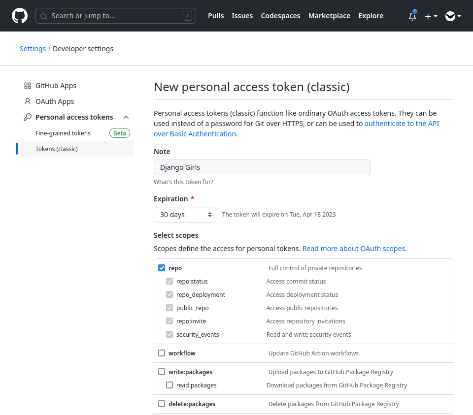
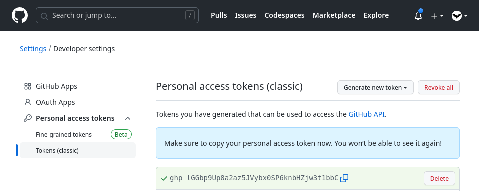

# Django Girls tutorial complementario

Pasos complementarios que aún no se encuentran en el tutorial oficial de Django Girls.

## Subiendo tu código a GitHub

Sigue esta sección de manera normal en el tutorial oficial,
hasta antes de ejecutar el comando:

```
$ git push -u origin master
```

Antes de ejecutar este comando, hay un paso importante que debes realizar para subir tu código a GitHub.
Debemos generar un token de acceso. Este procedimiento lo debes realizar una sola vez.

Para crear el token debemos seguir los siguientes pasos:

- Ingresa a https://github.com/settings/tokens/new
- En el campo `Note` ingresa una descripción para el token, por ejemplo: `Django Girls Cuenca`.
- En el campo `Select scopes` selecciona la opción `repo`.
- Deja los demás campos como están.



- En la parte inferior de la página da click en `Generate token`.
- Guarda el token generado en un lugar seguro, ya que no se mostrará nuevamente,
  y lo necesitarás para subir tu código a GitHub.



Ahora sí, puedes ejecutar el comando `git push -u origin main` te pedirá el usuario y contraseña.
Ingresa tu nombre de usuario de GitHub y el token generado en el paso anterior como la contraseña.

Eso es todo, ya puedes volver al tutorial oficial 😃.

### ¿Por qué tuve que realizar este paso adicional?

Por motivos de seguridad,
GitHub ya no acepta que la contraseña ingresada sea la de tu cuenta,
sino que se debe generar un token para este procedimiento.

Este cambio fue hecho a mediados del 2021,
y el tutorial oficial de Django Girls aún no ha sido actualizado para reflejar este cambio.

Además, en lugar de usar la palabra `master`, usaste la palabra `main`.
En el año 2020, GitHub cambió el cambio del nombre por defecto de la rama de nuevos proyectos
de `master` a `main`, por lo cual ahora debes usar esta palabra en los comandos.
